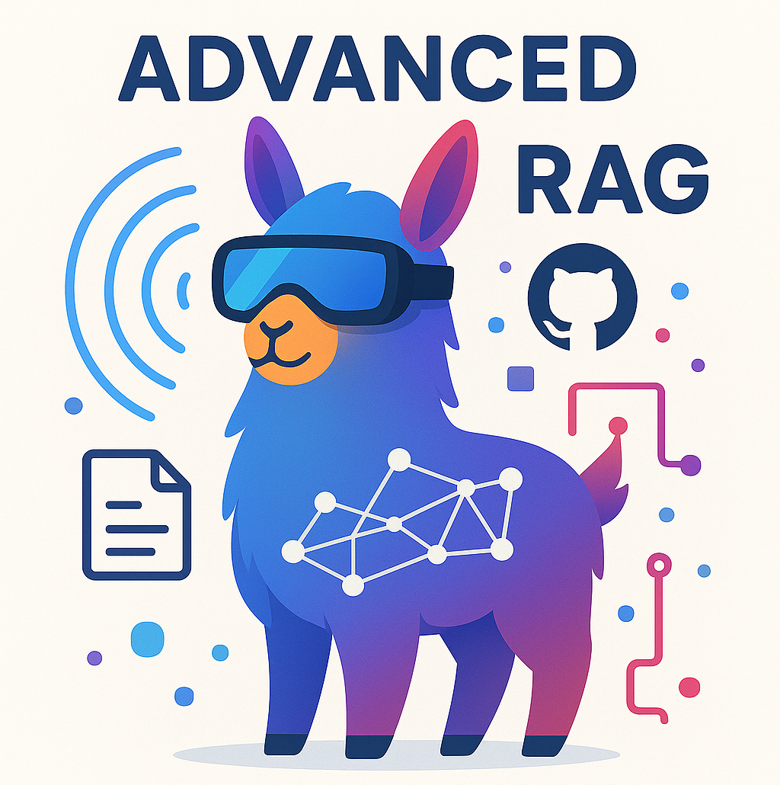
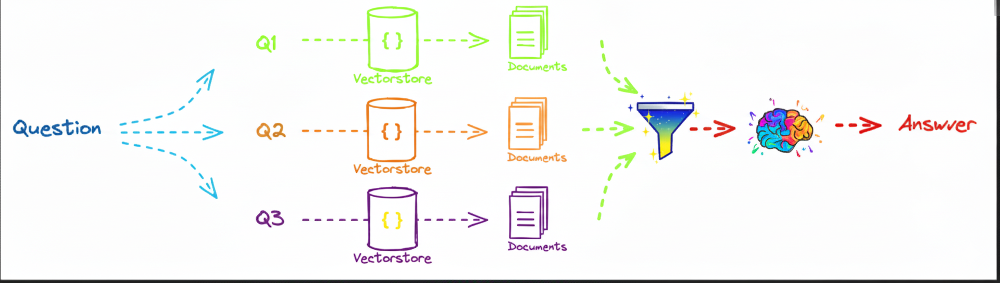

  

# Local-Advanced-RAG-types-with-Llama3

  

---
  
## Types of Advanced RAG: 
- [Multi-Query](#multi-query)
- [RAG-Fusion](#RAG-Fusion)
- [Answer recursively](#Answer-recursively)
- [Answer individually](#Answer-individually)

---
### 1. [Multi-Query](LocalRAG_MultiQuery_LLama3_Nvidia_Stocks.ipynb)
The Multi-Query automates the process of prompt tuning by using an LLM to generate multiple queries from different perspectives for a given user input query. For each query, it retrieves a set of relevant documents and takes the unique union across all queries to get a larger set of potentially relevant documents. By generating multiple perspectives on the same question, the MultiQueryRetriever can mitigate some of the limitations of the distance-based retrieval and get a richer set of results.

  
  

---
# RAG-Fusion (LocalRAG_RAGFusion_LLama3_Nvidia_Stocks.ipynb)
### 2. [RAG-Fusion](LocalRAG_RAGFusion_LLama3_Nvidia_Stocks.ipynb)
RAG-Fusion, a search methodology that aims to bridge the gap between traditional search paradigms and the multifaceted dimensions of human queries. Inspired by the capabilities of Retrieval Augmented Generation (RAG), this project goes a step further by employing multiple query generation and Reciprocal Rank Fusion to re-rank search results.

  
  

---
# Answer recursively
### 3. [Answer recursively](LocalRAG_Answer_recursively_LLama3_Nvidia_Stocks.ipynb)
The recursive RAG method, exemplified by Interleaving Retrieval with Chain-of-Thought (IRCoT), is an advanced approach for solving complex, multi-step questions. Unlike standard Retrieval-Augmented Generation (RAG), which performs a single initial document retrieval, this technique interleaves the reasoning and retrieval processes iteratively. It starts by using the question to retrieve initial context and generate the first logical step of an answer. Crucially, this intermediate thought or partial conclusion is then treated as a new, refined query to guide the next retrieval. This recursive loop—Reason 
→
 Retrieve 
→
 Reason—continues, with each step building upon the knowledge gained in the previous cycle. This process allows the Large Language Model to acquire increasingly specific, targeted information as it progresses, ensuring that its ongoing reasoning is continuously grounded by up-to-date, externally retrieved evidence, thereby significantly boosting accuracy on knowledge-intensive, compositional queries and mitigating factual errors (hallucination).

  
  

---
# Answer individually
### 4. [Answer individually](LocalRAG_Answer_individually_LLama3_Nvidia_Stocks.ipynb)
An advanced method for information retrieval and question answering called the Answer Individually .In this method, a main Question is broken down into multiple sub-questions (Q1, Q2, Q3). Each sub-question independently uses a Vectorstore to retrieve relevant Documents. Subsequently, a Large Language Model processes each set of retrieved documents to generate an Answer for that specific sub-question. Finally, all the individual answers generated for the sub-questions are combined and processed again by a final LLM to provide a comprehensive and final Answer to the original main question. This approach allows the model to better handle the complexities of multi-faceted questions and deliver more accurate and complete responses.

  
  

---
